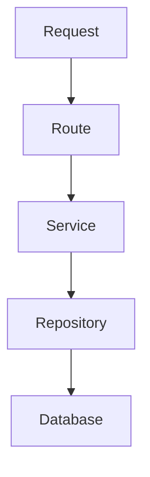
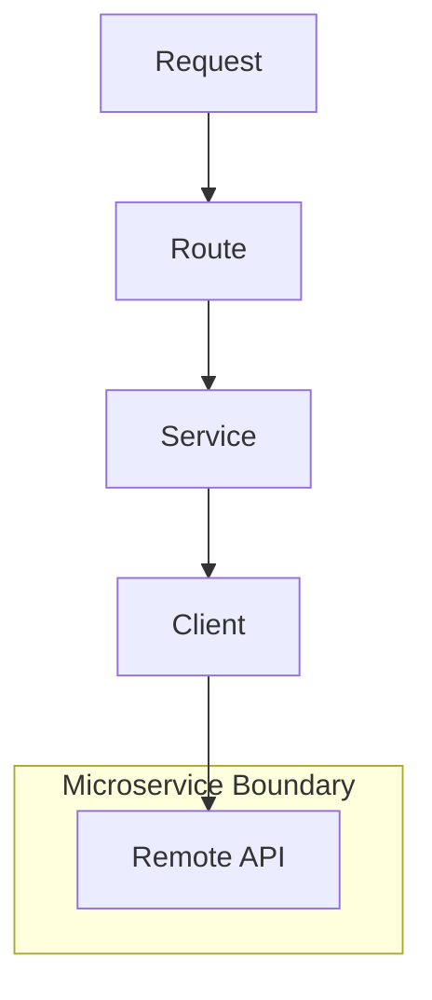
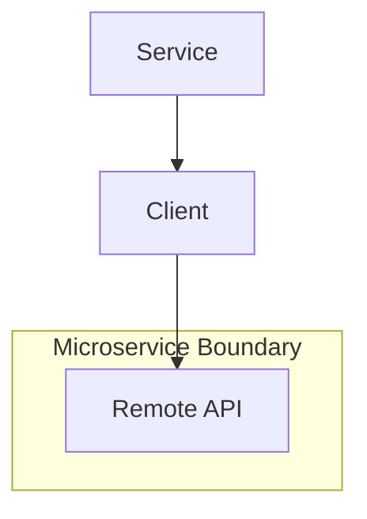

## Architectural Evolution Patterns

In a well-structured architecture, the system should be able to adapt to changes in infrastructure or business requirements with minimal impact to unrelated components. Below are patterns for evolving the system safely.

---

### 1. Extracting a Service into a Microservice

**Scenario:**  
A local service (e.g. `UserService`) is extracted into a standalone microservice due to scaling, ownership, or deployment needs.

**Approach:**

- Keep the **Service interface unchanged**.
- Create a **Client** that implements the same interface and delegates calls to the new microservice via HTTP, gRPC, etc.
- Replace the use of a **Repository** (or in-memory logic) with the new **Client** inside the existing service.
- **Other services and routes are unaffected**, as they continue to depend on the service interface.

#### Before: Monolithic Internal Service



- Service uses a local Repository to access the Database.
- All logic is in-process.

#### After: Externalized as Microservice



- The same service interface is preserved.
- The internal Repository is replaced with a Client.
- All logic is now served by an external Remote API.
- Consumers of the service remain unchanged.

**Benefits:**
- Isolation of the change to one place
- No impact on consumers of the service
- Enables gradual migration and testing

---

### 2. Replacing ORM with Raw SQL

**Scenario:**  
You decide to remove an ORM (e.g. SQLAlchemy) in favor of raw SQL for performance, transparency, or maintainability.

**Approach:**

- Refactor only inside **Repository** methods.
- Keep method signatures and return types the same.
- No changes required in **Service** or **Route** layers.

**Benefits:**
- No ripple effects
- Easier rollback
- Reuse of business logic remains intact

---

### 3. Moving Business Logic into Background Jobs

**Scenario:**  
A process in a `Service` becomes long-running and should be offloaded to a task queue.

**Approach:**

- Wrap the logic in a task
- Keep a thin `Service` method that queues the task instead of executing it directly.
- The logic in the worker task can reuse existing services and repositories.

**Before:**
```
Route → Service (does work inline)
```

**After:**
```
Route → Service → Queue → Worker → Service
```

**Benefits:**
- Same entry point for business logic
- No duplicate logic in workers
- Minimal changes to consumers

---

### 4. Parallel API Development (Stub Client)

**Scenario:**  
You need to integrate with an external API that is still under development or not yet accessible (e.g. being built by another team or vendor).

**Approach:**

- Create a **Client** that implements the expected interface of the future API.
- Instead of making real requests, the Client returns **hardcoded test data** (mock/stub).
- Build and test your Service logic as if the API exists.
- Even demos and end-to-end flows can work using this stubbed data.
- When the real API becomes available, you **replace the stub implementation** with actual HTTP/gRPC calls — no changes required in your Service.

#### Stub Phase

```mermaid
graph TD
    A[Service] --> F[Client (Stub)]
    F --> M[Test Data]
```

- Client returns static or mock data.
- Service logic is fully testable and operational.

#### Integration Phase



- Same Client interface is now wired to real API.
- The rest of the system remains untouched.

**Benefits:**
- Enables independent, parallel development
- Reduces project bottlenecks and integration delays
- Facilitates early testing, demos, and feedback
- Smooth transition to production API with no architectural change

---


### 5. Isolated Exploration of Unfamiliar External APIs

**Scenario:**  
You need to integrate with a third-party API that is:
- Poorly documented
- Inconsistent in structure
- Returning deeply nested or verbose responses

This creates overhead for new developers who must reverse-engineer behavior and edge cases before they can safely use the API.

**Approach:**

- Create a **test/exploration client** next to the main `Client`.
- This client does not implement any service logic — it exists to **document and explore** the raw API.
- Use this test client to:
  - Print/log full response payloads
  - Try different parameters
  - Note edge cases or response anomalies
  - Maintain example calls or integration tests
- Clearly separate it from production code, but keep it versioned alongside the real implementation.

#### Example Directory Structure

```
clients/
├── analytics_client.py        # Production client (used in services)
└── analytics_client_test.py   # Exploration client (for dev understanding)
```

#### Example Use Case

Even if the production client uses only `data['count']`, the test client might show:
```json
{
  "meta": { "version": "v2", "timestamp": "..." },
  "data": {
    "count": 123,
    "users": [...],
    "status": "partial"
  }
}
```

**Benefits:**
- Reduces onboarding time for new developers
- Preserves institutional knowledge in code
- Avoids bloating the production client with debug logic
- Encourages shared understanding of real-world API behavior

---
