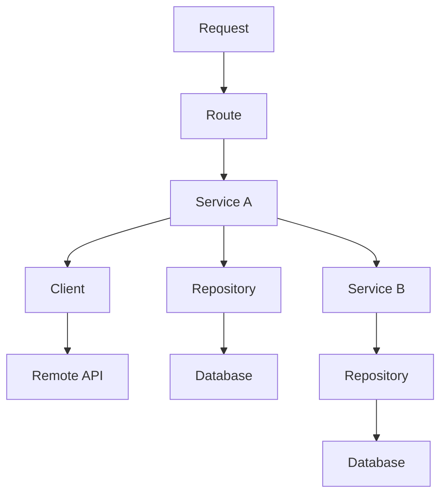

# Request Handling Architecture

This document describes a clean, layered architecture for processing incoming HTTP requests. Each layer has a focused responsibility and clear boundaries, enabling modular, testable, and maintainable systems.

---

## Diagram

---

## Architecture Layers

### 1. Request
An incoming HTTP request from a client (e.g. browser, mobile app, or another backend service).  
Contains headers, method, URL, and body data.

---

### 2. Route
The router layer determines which handler or controller to invoke based on the request path and method.

**Responsibilities:**
- Routing and parameter extraction
- Input validation
- **Mapping service results into framework-specific responses**  
  (e.g. converting return values into `JSONResponse`, setting HTTP status codes, headers)
- Exception handling and translation into HTTP errors

This layer acts as a **boundary between the web framework and the business logic**, keeping services decoupled from the framework.

---

### 3. Service
The business logic layer.

**Characteristics:**
- Completely **independent of the web framework**
- Accepts and returns plain Python objects (dicts, DTOs, primitives)
- Does **not** use `Request`, `Response`, `Depends`, etc.
- Easily testable and reusable across different contexts (e.g. CLI, RPC, HTTP)

**Responsibilities:**
- Executes business workflows
- Calls **Repository** for local data
- Calls **Client** to communicate with **Remote APIs**
- May delegate logic to another **Service**

---

### 4. Repository
Responsible for accessing the database.

**Design Principles:**
- No shared abstractions or base classes (e.g. `BaseRepository`, `CRUDMixin`)
- Each method encapsulates a complete, independent query
- Easily replaceable: can rewrite ORM queries to raw SQL without breaking others
- Repository layer is **not** a logic layer — it’s a pure data access interface

This promotes independence between queries, better clarity, and flexibility in migration.

---

### 5. Database
A relational or NoSQL database (e.g. PostgreSQL, MySQL, MongoDB).  
Stores persistent data used by the application.

---

### Additional Components

#### Client
Handles communication with external systems via HTTP, gRPC, etc.

#### Remote API
Any external service (e.g. payment processor, third-party data provider) the application interacts with.

#### Another Service
Represents service composition: a service may call another service to reuse logic or split responsibilities.

---

## Summary

This architecture enforces strict separation of concerns:

- **Routing layer**: Knows about HTTP and the framework.
- **Service layer**: Knows about the business logic, but not how it's delivered.
- **Repository layer**: Knows how to access data, but not why or when.
- **Client layer**: Knows how to call external services, but not the app's logic.

This results in code that is clean, testable, and easier to evolve.
